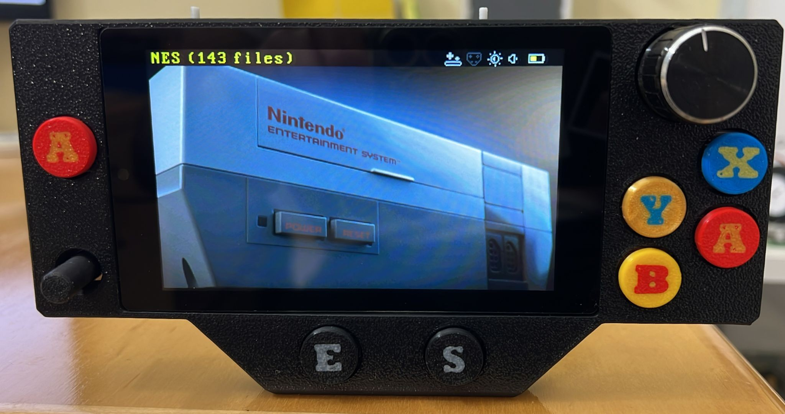
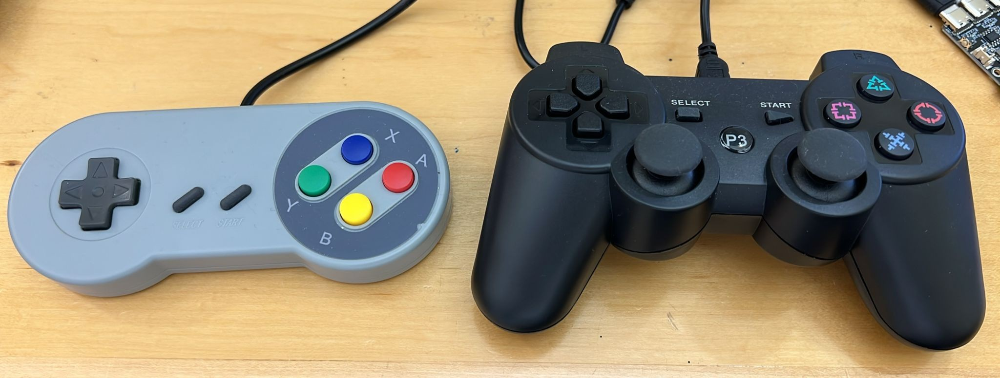
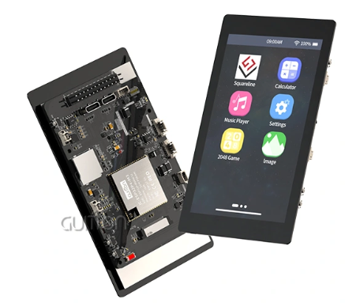
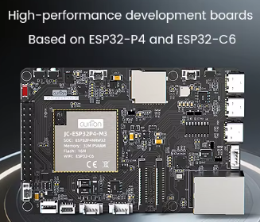
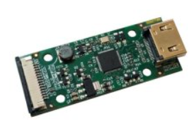
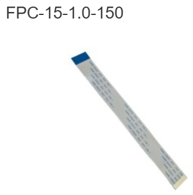

# 🎮 RetroESP32-P4

RetroESP32-P4 is a retro gaming and application platform based on the powerful ESP32-P4.

Built from my recent revival of the original RetroESP32, this project brings modern UI, **HDMI** support, touchscreen support, 15 emulators, and native apps running from SRAM.

---

# ✨ Features

## 🎮 15 Supported Emulators

- NES
- Game Boy
- Game Boy Color
- Game Gear
- Sega Master System
- ColecoVision
- Sinclair ZX
- Atari Lynx
- Atari 7800
- Atari 2600 (Supports paddle for breakout, Kaboom and the alike in the console mode)
- Atari 800XL / 5200  (Supports paddle for breakout, Kaboom and and the alike in the console mode)
- PC Engine
- SNES
- **The mighty NeoGeo**!!! Fully operational!
- Sega Genesis / Mega Drive

## ⚡ Performance

- Most systems run at 60 FPS (without frame skips!)
- SNES / Genesis run 60 FPS (with around 10 frames drops per second - game play is totaly smooth)
- NeoGeo 60 FPS (with around 0-20 frames drops per second - game play is totaly smooth)

## 💾 Save States

**All** emulators support Save / Load states (some from within the games)

## 🎮 USB Gamepads

Plug **any** USB controller and automatic button mapping starts on first use (**For the HDMI version you need L2 and R2 for Menu and Volume buttons in SNES and Genesis, a PS3 controller is best, cheap clones  are available on AliExpress**)

---

# 🖥️ Supported Hardware

## 1. Guition ESP32-P4 4.3" LCD

- 480x800 touchscreen (https://www.guition.com/esp32p4-display-module/esp32p4-display)

- Full handheld mode

- Can be purchased on AliExpress or from Guition site:

  

## 2. HDMI Version

- Guition ESP32-P4 board (https://www.guition.com/esp32p4-display-module/esp32p4-display-module)

- Olimex LT8912 DSI(MIPI)-to-HDMI bridge (https://www.olimex.com/Products/IoT/ESP32-P4/MIPI-HDMI/open-source-hardware) (**Be very careful to use the correct CSI flat cable**, better to buy it from Olimex - https://www.olimex.com/Products/IoT/ESP32-P4/FPC-15-1.0-150/)

  

  

  

  

---

# 🧩 Native Apps from SRAM

Apps load from SD card and execute directly from SRAM.

Included:

- Doom
- Quake
- Duke3D
- OpenTyrian
- Example demo template

---

# 🖥️ GUI Improvements

- Modern launcher
- Fast navigation
- Search for ROM files
- Better file browsing

---

# 🚀 Getting Started

1. Format SD card to FAT32
2. Copy contents of `/SDCARD`
3. Flash firmware to address **0** (**RetroESP32_P4_v1**.bin or **RetroESP32_P4_HDMI_v1**.bin) (https://espressif.github.io/esptool-js/)
4. Insert SD card
5. Connect controller or plug into the console frame
6. For NeoGeo games you will need to run the python script to generate the cache files (script is at the SD card folder)
7. Enjoy

---

# 📦 Repository Contents

- Firmware binaries
- Source code
- SD card files
- Apps
- Templates
- Console board production file and schematic
- STL files

---

# 🔧 Planned Future Updates

- More emulators
- Better performance
- More apps
- Improved UI
- WiFi features
- BLE controllers

---

# 🙌 Feedback

This is only Version 1.

Suggestions, testing results, and contributions are welcome.

---

# 📜 Credits

Based on the original RetroESP32 project, revived and modernized for ESP32-P4.

To original creators of the RetroESP32

The creator of the ESP32 based Atari 800 emulator

SNES and Genesis creators

NeoGeo Linux version creator

## 📜 License

MIT License

## ⭐ Support

If you like this project:

- ⭐ Star the repo
- 🍴 Fork it
- 🧑‍💻 Contribute

------

## 💥 Final Note

RetroESP32-P4 is not just another emulator project — it's a demonstration of how far modern microcontrollers can go when optimized correctly.
