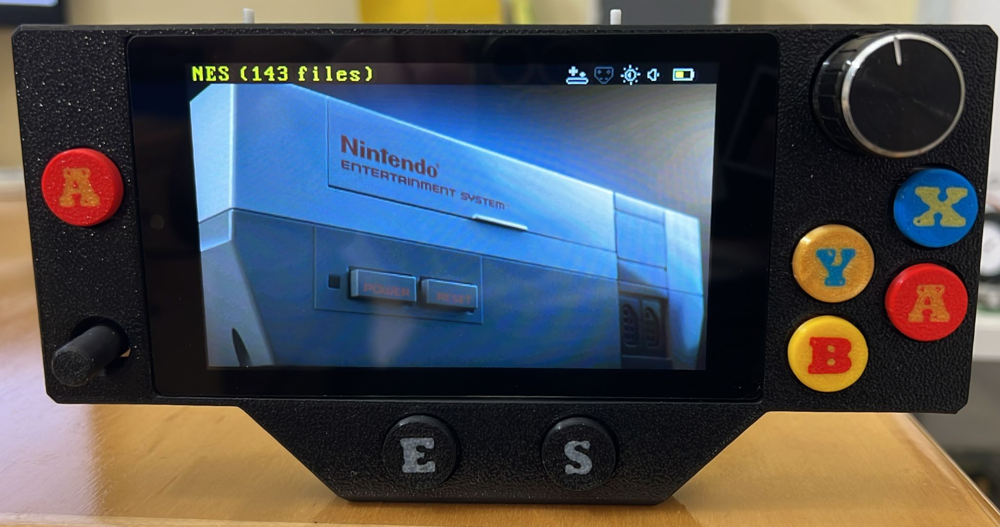
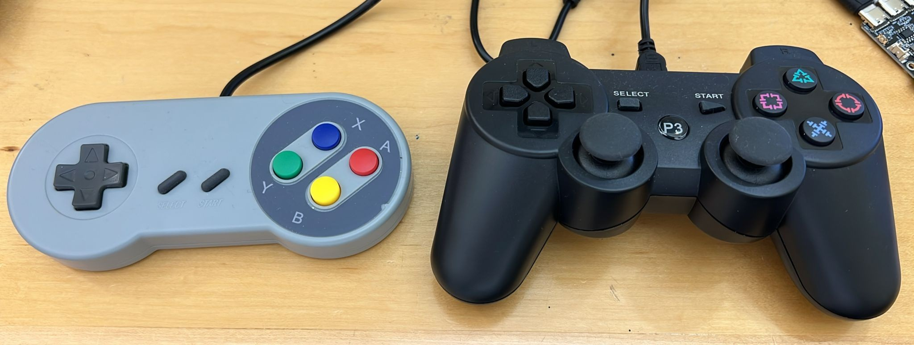
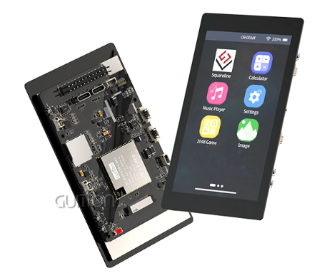
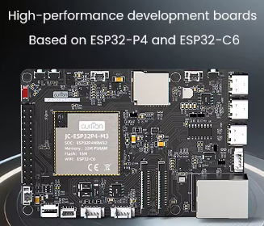
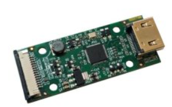
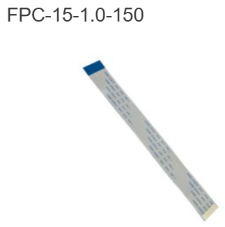

# 🕹️ RetroESP32-P4

### Fifteen game consoles and native PC-era shooters — on a single ESP32-P4 microcontroller.

**No GPU. No Linux. Bare-metal RISC-V.**

---

RetroESP32-P4 is an open-source retro-gaming and application platform built on the **ESP32-P4** — a dual-core RISC-V microcontroller with no dedicated GPU. Grown out of a revival of the original [RetroESP32](https://github.com/retro-esp32/RetroESP32), it brings a modern touchscreen launcher, **HDMI output**, **15 emulators**, and **native apps that execute from PSRAM** — including full Doom and Quake.

The headline: SNES, Genesis/Mega Drive and the mighty **NeoGeo** all run at **60 FPS**.

---

## ✨ Highlights

- 🎮 **15 emulators** — NES through NeoGeo, all with save/load states
- ⚡ **60 FPS** on the 16-bit heavyweights (SNES, Genesis, NeoGeo)
- 🧩 **Native apps from PSRAM** — Doom, Quake, Duke Nukem 3D, OpenTyrian
- 🖥️ **Two builds from one firmware** — 4.3″ touchscreen handheld *or* HDMI console
- 🎛️ **Any USB gamepad** — auto-detected and auto-mapped on first use
- 💾 **Save states** on every core, some accessible in-game
- 📦 **Everything included** — firmware, source, SD files, apps, PCB, schematic, and case STLs

---

## 🎮 Supported Emulators

| Family | Systems |
|--------|---------|
| **Nintendo** | NES · Game Boy · Game Boy Color · **SNES** ⭐ |
| **Sega** | Master System · Game Gear · **Genesis / Mega Drive** ⭐ |
| **Atari** | 2600 · 800XL / 5200 · 7800 · Lynx |
| **Arcade & more** | **NeoGeo** ⭐ · PC Engine · ColecoVision · Sinclair ZX |

⭐ = hand-tuned to hold **60 FPS** on the P4.

> Atari 2600 and 800XL/5200 support paddle controllers for Breakout, Kaboom! and the like in console (HDMI) mode.

### ⚡ Performance

- Most systems run at **60 FPS with no frame-skip**.
- **SNES / Genesis** — locked 60 FPS via a real-time frame pacer (a handful of *rendered* frames may drop under heavy load; game logic and audio stay at full speed, so play feels perfectly smooth).
- **NeoGeo** — 60 FPS, fully operational, fed by a sprite cache with batched bank prefetch.

### 💾 Save States

**All** emulators support Save / Load states — several directly from the in-game menu.

---

## 🎛️ Controllers

Plug in **any** USB controller and automatic button mapping starts on first use.

> On the **HDMI** build, SNES and Genesis map Menu and Volume to **L2/R2**, so a PS3-style pad works best. Inexpensive clones are widely available.

---

## 🖥️ Supported Hardware

### 1. Guition ESP32-P4 4.3″ LCD — the handheld

A single [480×800 touchscreen module](https://www.guition.com/esp32p4-display-module/esp32p4-display) becomes a full handheld (the one pictured up top, in a 3D-printed shell). Available on AliExpress or from Guition.

### 2. HDMI Version — the console

Drive a TV by pairing the Guition ESP32-P4 board with an **Olimex LT8912 MIPI-DSI-to-HDMI bridge**.

- [Guition ESP32-P4 board](https://www.guition.com/esp32p4-display-module/esp32p4-display-module)
- [Olimex LT8912 DSI-to-HDMI bridge](https://www.olimex.com/Products/IoT/ESP32-P4/MIPI-HDMI/open-source-hardware)

> ⚠️ **Use the correct DSI flat cable** — a mismatched ribbon will not work. Buy it from Olimex: [FPC-15-1.0-150](https://www.olimex.com/Products/IoT/ESP32-P4/FPC-15-1.0-150/).

---

## 🧩 Native Apps from PSRAM

Beyond emulators, RetroESP32-P4 runs **native** applications. A compact app format (**PAPP**) loads binaries off the SD card, memory-maps them into PSRAM, and executes them in place through a shared, versioned service ABI — so you can add apps **without reflashing firmware**.

Included:

- **Doom**
- **Quake**
- **Duke Nukem 3D**
- **OpenTyrian**
- Example demo template (build your own)

---

## 🚀 Getting Started

1. Format an SD card to **FAT32**.
2. Copy the contents of **`/SDCARD`** onto it.
3. Flash the firmware to address **`0`** using the [web esptool](https://espressif.github.io/esptool-js/):
   - **`RetroESP32_P4_v1.bin`** — handheld / LCD build
   - **`RetroESP32_P4_HDMI_v1.bin`** — HDMI build
4. Insert the SD card.
5. Connect a USB controller (or use the built-in console frame).
6. **NeoGeo only:** run the included Python script once to generate the sprite-cache files (script is in the SD-card folder).
7. Power on, pick a system, and play. 🎉

---

## 🧠 Under the Hood

- **One image per emulator** — each core is its own OTA flash partition; the launcher switches the active partition and reboots straight into the game, so every emulator gets the whole chip.
- **PPA hardware scaler** — with no GPU, the P4's on-chip 2D Pixel-Processing Accelerator handles rotation, scaling and format conversion.
- **Execute-in-place apps** — the PAPP loader maps SD-card binaries into PSRAM and calls them through a service vtable.
- **Dual-core scheduling** — hot paths pinned to internal SRAM/IRAM; the second core carries audio and display so game logic keeps pace.

**Silicon:** ESP32-P4 · dual-core RISC-V @ 360 MHz · 32 MB PSRAM · 16 MB flash.

---

## 📦 Repository Contents

- Firmware binaries (LCD + HDMI)
- Full source code
- SD-card files
- Native apps + PAPP template
- Console board production files and schematic
- Case STL files
- **Link to a folder with all needed**: https://drive.google.com/drive/folders/1b3OWLKbuuy3KIyPls8iDnDMXTKGiJoFR?usp=sharing

---

## 🔧 Roadmap

- More emulators
- Better performance
- More native apps
- Improved UI
- Wi-Fi features
- BLE controllers

---

## 🙌 Contributing

This is only **Version 1**. Suggestions, testing results, and pull requests are all welcome. If you build one, share a photo!

---

## 📜 Credits

Based on the original **RetroESP32** project, revived and modernized for the ESP32-P4. With thanks to:

- The original RetroESP32 authors
- The creator of the ESP32-based Atari 800 emulator
- The SNES and Genesis core authors
- The author of the NeoGeo (gngeo) Linux port

## 📄 License

MIT License.

## ⭐ Support

If you like this project:

- ⭐ **Star** the repo
- 🍴 **Fork** it
- 🧑‍💻 **Contribute**

---

> RetroESP32-P4 isn't just another emulator project — it's a demonstration of how far a modern microcontroller can go when it's optimized correctly.
